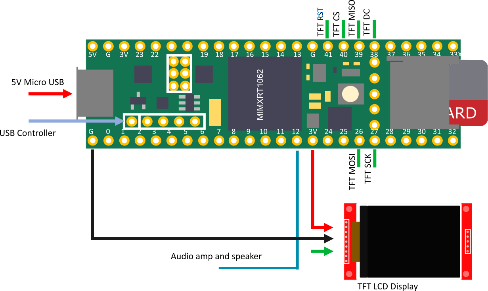

# SameBoyT4
Port of [SameBoy](https://github.com/LIJI32/SameBoy) to the [Teensy4.1](https://www.pjrc.com/store/teensy41.html) microcontroller.  
This was just an educational exercise. All features of SameBoy are not implemeted. The performance is okay, but certainly not 100%.

* Load ROMs/saves of the SD card. Currently filenames are hardcoded.
* USB input driver (hardcoded for Xbox360 type controllers)
* Save and load SRAM (Press Y to save)
* Audio supported!

## Needed Parts
| Qty | Part Description | Link |
|--|--|--|
| 1 | Teensy 4.1 | https://www.pjrc.com/store/teensy41.html |
| 1 | USB Host Cable | https://www.pjrc.com/store/cable_usb_host_t36.html |
| 3 | 0.1" Pin Header | https://www.pjrc.com/store/header_24x1.html |
| 1 | 64Mbit PSRAM  SOIC-8 | https://www.pjrc.com/store/psram.html |
| 1 | ILI9341 TFT LCD Display (320x240) | [AliExpress](https://www.aliexpress.com/wholesale?catId=0&SearchText=ili9341%20tft) |

## Wire-up
<p align="center"></p>

<p align="center"></p>

## Compile
### CLI (Requires python and python-pip)
```
git clone https://github.com/Ryzee119/SameBoyT4.git --recursive
python -m pip install --upgrade pip
pip install platformio
cd SameBoyT4
platformio run -e teensy41
```
### Visual Studio Code
* Download and install [Visual Studio Code](https://code.visualstudio.com/).
* Install the [PlatformIO IDE](https://platformio.org/platformio-ide) plugin.
* Clone this repo recursively `git clone https://github.com/Ryzee119/SameBoyT4.git --recursive`
* In Visual Studio Code `File > Open Folder... > SameBoyT4`
* Hit build on the Platform IO toolbar (`✓`).

## Program
### Teensy (using Teensy Loader)
* Connect the Teensy to your PC using a MicroUSB cable.
* Run the [Teensy Loader Application](https://www.pjrc.com/teensy/loader.html).

### Teensy (using Visual Studio Code)
* Setup Visual Studio Code as per the Compile instructions.
* Hit the program button on the Platform IO toolbar (`→`).

## Usage
* Download the latest release of the winsdl version of [SameBoy](https://github.com/LIJI32/SameBoy/releases/) and copy the `.bin` files onto your SD card
* Copy a GB/GBC rom onto the SD card and rename it to `myrom.gbc`. Alternatively modify `platformio.ini` to change the hardcoded name.

## Images
<p align="center">  </p>

<p align="center">  </p>

<p align="center"></p> 
